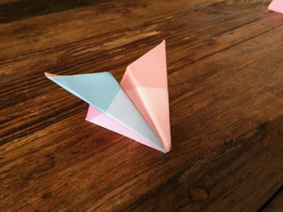

# Welcome to Atherplanes
## This is a paper airplane company
We will help you learn to fold/make and fly paper airplanes
## Different types of planes:
1 Pink Angels, 2 Stunt Maker, 3 Mini Copilot, 4 Rainbow Lighting, 5 Twisters, 6 Zoomers, 7 Soarer
      
 
## How to throw
### Throwing the plane corectly is very important. It dependes on witch plane, 
If its a pink angel, you want to throw it lightly bending your rist back then moving your rist forward then lanching.
But the stunt maker is built so you can throw it as hard as you like

## How to make pink angeles

1, First fold the top two corners down to the middle of the paper.

2, Then fold the point on the top of the paper, down to the bottum of the paper.

3, Then fold the top two corners down to the middle of the bottum of the paper.

4,Then flip over the paper and fold it in half so it looks like a smaller triangel.

5,Then fold down the first flap of the two flaps so it looks like this.

6, Then flip it over and fold the other flap down so it looks like this.

7, then fold the two flaps back up so it looks like this.  now your done! hope you enjoy your paper airplane.

## How To Make Saurer

1, First fold in half leignth wize and unfold.

2, Then fold the top two corners down into the middle, on the crease.

3, Now fold in halfso it looks like this

